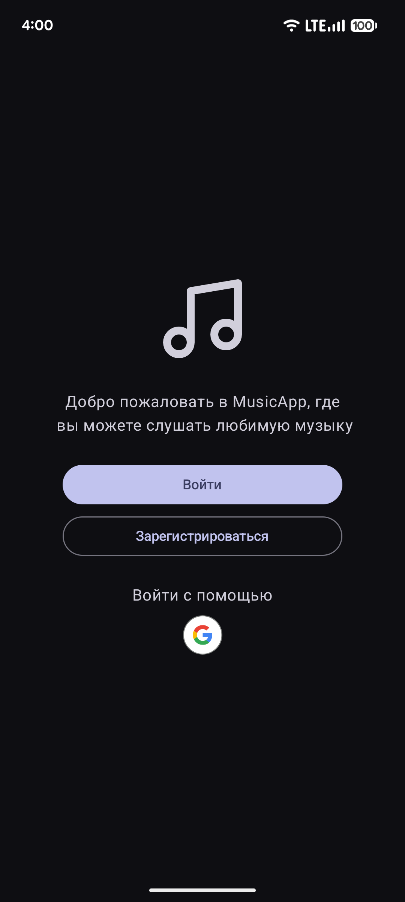
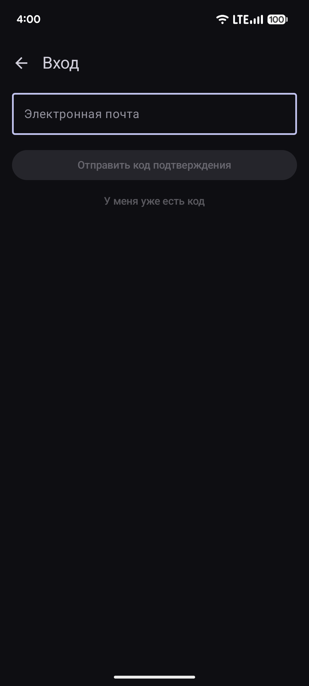
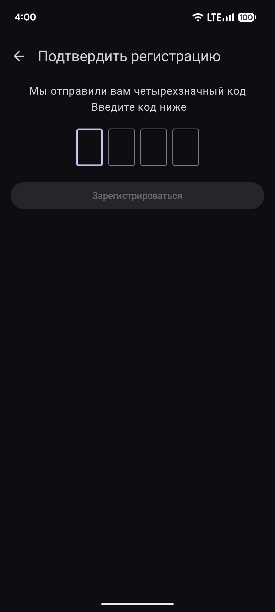
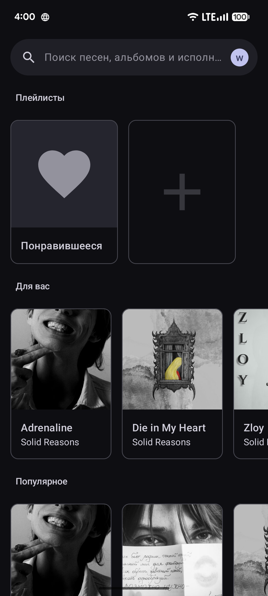
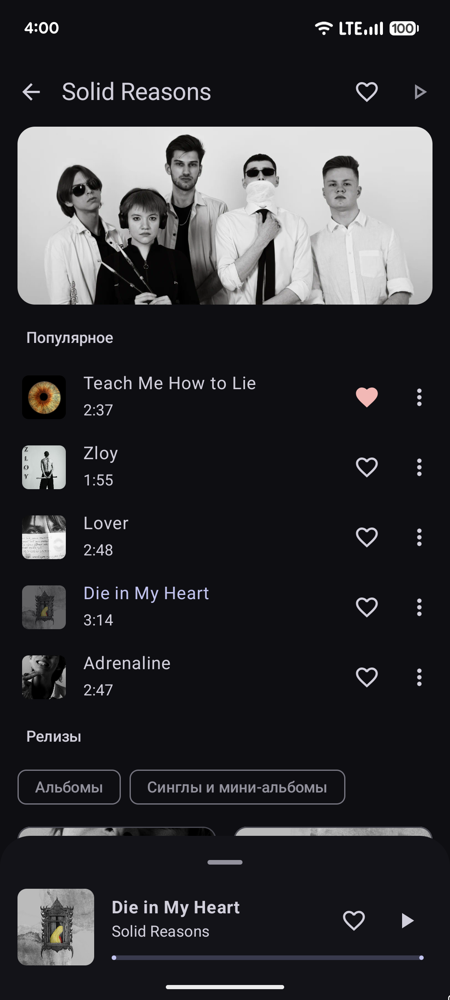
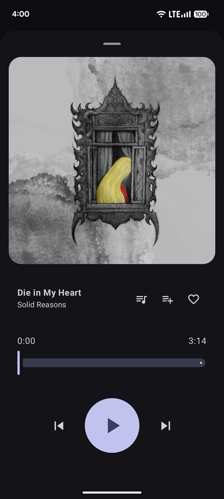
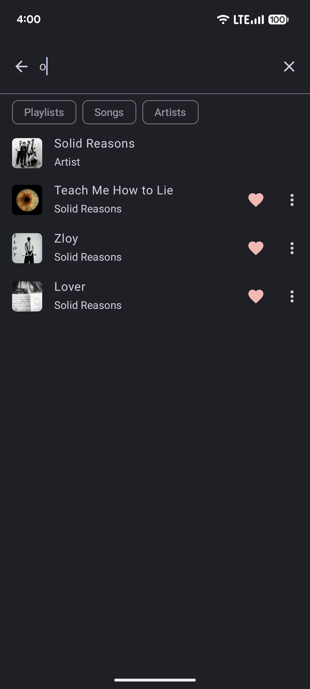

# MusicApp 🎵

A modern music streaming app for **Android and iOS** built with **Compose Multiplatform** and Material 3.

## Features

- **🎧 Full music player** with background playback and system integration
- **🔐 User authentication** with email verification and Google Sign-In
- **🏠 Personalized home** with artist discovery and playlist management
- **❤️ Favorites & following** system for personalization
- **🔍 Search** across songs, artists, and playlists
- **🌙 Dark/Light themes** with system theme detection
- **🌍 Multi-language** support (English & Russian)
- **📱 System controls** on lock screen and quick settings

## Backend

The app consumes the [music-api](https://github.com/witelokk/music-api) backend for authentication, music metadata, streaming, and all API endpoints.

- By default, the app is configured to use the hosted backend at:
  ```kotlin
  // composeApp/src/commonMain/kotlin/com/witelokk/musicapp/AppModule.kt
  const val DEFAULT_BASE_URL = "https://music.witelokk.ru/"
  ```
- To use your own backend, you can either:
  - On the **Welcome** screen, tap the app logo 7 times to reveal the hidden **Server URL** field, enter your backend URL (used immediately for login and API calls).
  - Or change `DEFAULT_BASE_URL` in `AppModule.kt` to point to your deployment and rebuild the app.

## Tech Stack

- **UI / Shared**
  - Compose Multiplatform
  - Material 3
  - Navigation Compose
  - Coil 3 (with Ktor 3 integration)
  - Kotlin Multiplatform (common business logic, view models, networking)
- **Networking & Data**
  - Ktor Client (OkHttp on Android, Darwin on iOS)
  - Kotlinx Serialization
  - AndroidX DataStore
  - Auto-generated API client from `music-api`
- **Architecture**
  - MVVM
  - Koin for DI (including `koin-compose` view models)
  - AndroidX Lifecycle (Compose integration)
- **Media & Auth (Android)**
  - Media3 ExoPlayer + HLS + MediaSession
  - Android Credentials API
  - Google Identity / Google Sign-In

## Requirements

**Common**
- Kotlin `2.3.20+`
- JDK 11+

**Android**
- Android Studio (Hedgehog / Ladybug or newer)
- Android SDK 24+ (minSdk 24)
- Target SDK 36

**iOS**
- Xcode 15+
- CocoaPods
- iOS 16.0+ deployment target

## Running the App

### 1. Backend (optional if you use the hosted instance)

If you want to run your own backend:

1. Clone and run [music-api](https://github.com/witelokk/music-api).
2. Update `baseUrl` in `composeApp/src/commonMain/kotlin/com/witelokk/musicapp/AppModule.kt` to point to your backend URL.

### 2. Android

1. Open the project root in **Android Studio**.
2. Let Gradle sync.
3. Select the `composeApp` Android run configuration.
4. Run on an Android device or emulator.

### 3. iOS

1. Install CocoaPods dependencies:
   ```bash
   cd iosApp
   pod install
   ```
2. Open `iosApp/iosApp.xcworkspace` in **Xcode**.
3. Select an iOS simulator or device.
4. Build and run the `iosApp` target.

## Screenshots

<p float="center">







</p>

## Project Structure

```
MusicApp/
├── composeApp/                              # Shared Kotlin Multiplatform + Android app
│   ├── src/commonMain/kotlin/com/witelokk/musicapp/
│   │   ├── api/                            # Auto-generated API client
│   │   ├── components/                     # Reusable UI components
│   │   ├── screens/                        # Screen composables
│   │   ├── viewmodel/                      # ViewModels
│   │   ├── App.kt                          # Root Compose app
│   │   └── AppModule.kt                    # DI & backend base URL
│   ├── src/androidMain/                    # Android-specific implementations
│   └── src/iosMain/                        # iOS-specific implementations
├── iosApp/                                 # iOS app (Xcode project + workspace)
└── gradle/libs.versions.toml               # Dependency versions
```

## License

MIT License — see [LICENSE](LICENSE) for details.
