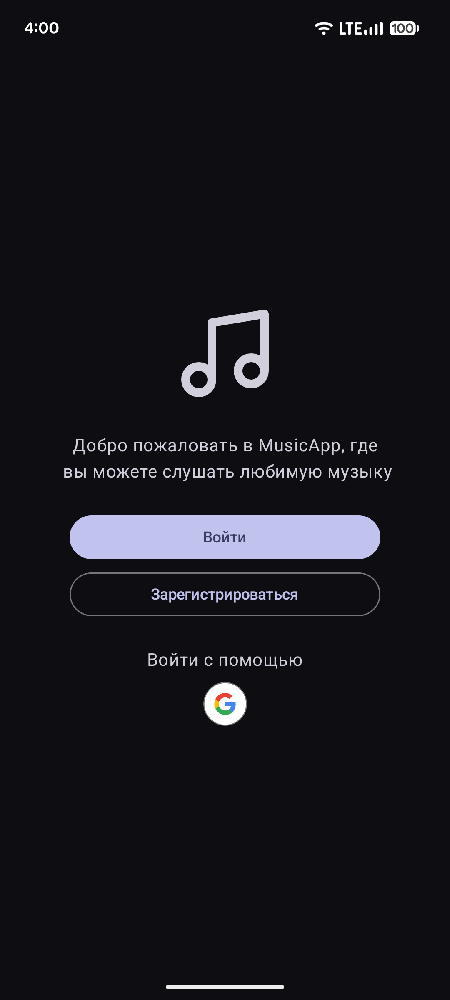
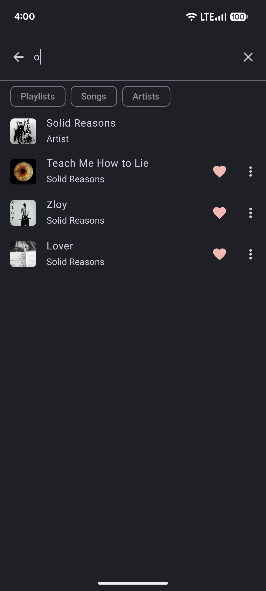

# MusicApp 🎵

A modern Android music streaming app built with Jetpack Compose and Material 3 design.

## Features

- **🎧 Full music player** with background playback and system integration
- **🔐 User authentication** with email verification and Google Sign-In
- **🏠 Personalized home** with artist discovery and playlist management
- **❤️ Favorites & following** system for personalization
- **🔍 Search** across songs, artists, and playlists
- **🌙 Dark/Light themes** with system theme detection
- **🌍 Multi-language** support (English & Russian)
- **📱 System controls** on lock screen and quick settings

## Backend Requirement

This app requires the [music-api](https://github.com/witelokk/music-api) backend to function. The backend provides authentication, music metadata, streaming, and all API endpoints.

## Tech Stack

- **Frontend**: Jetpack Compose, Material 3, Navigation Compose
- **Backend**: Ktor Client, OkHttp, Kotlinx Serialization
- **Architecture**: MVVM with Koin DI, AndroidX Lifecycle
- **Media**: Media3 ExoPlayer, Media3 Session
- **Auth**: Android Credentials API, Google Identity

## Requirements

- Android SDK 24+ (Android 7.0+)
- Target SDK 35 (Android 15)
- Kotlin 2.1.0+, Java 11+
- Backend API running and accessible

## Installation

1. **Set up backend**
   - Clone and run [music-api](https://github.com/witelokk/music-api)

2. **Configure backend URL**
   - Open `app/src/main/java/com/witelokk/musicapp/DI.kt`
   - Update `baseUrl`:
   ```kotlin
   val baseUrl = "https://your-backend-url.com/"
   ```

3. **Build and run**
   - Open in Android Studio
   - Sync project and run

## Screenshots






## Project Structure

```
MusicApp/
├── app/src/main/java/com/witelokk/musicapp/
│   ├── api/                    # Auto-generated API client
│   ├── components/             # Reusable UI components
│   ├── screens/                # Screen composables
│   ├── viewmodel/              # ViewModels
│   ├── App.kt                  # Main app composable
│   └── DI.kt                   # Dependency injection & base URL
└── gradle/libs.versions.toml   # Dependency versions
```

## License

MIT License - see [LICENSE](LICENSE) file for details.
